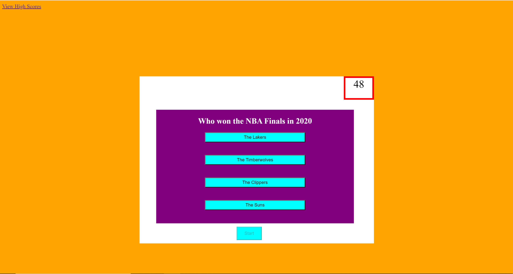
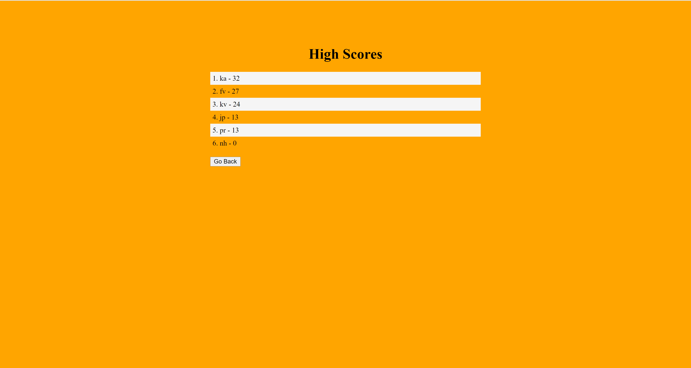

# Quiz2021

## Description:
A Quiz Game Application about the NBA

## Tools:
* Javascript
* HTML
* CSS

## User Experience:
When the page loads the user is presented with a quiz box with disabled buttons for the choices. Once the Start button is clicked the quiz begins and the choice fields are populated with choices and the question is presented to the user right above the choices. The timer start counting down from 50 seconds as well. Everytime the user selects the wrong answer the clock loses 5 seconds and a message is displayed that says wrong. If the user selects the correct answer a message pops up and says correct. Whether the selection is right or wrong a new question is displayed. When time runs out or the player finishes all questions the user is prompted to enter in their initials and a submit button. Once the user clicks the submit button the user is presented with the highscores that are stored in local storage. The user can also click the View High Scores link to view the high scores as well.

## Screenshots:

## Links:

https://github.com/JosephRhines/Quiz2021 
 
https://josephrhines.github.io/Quiz2021/

